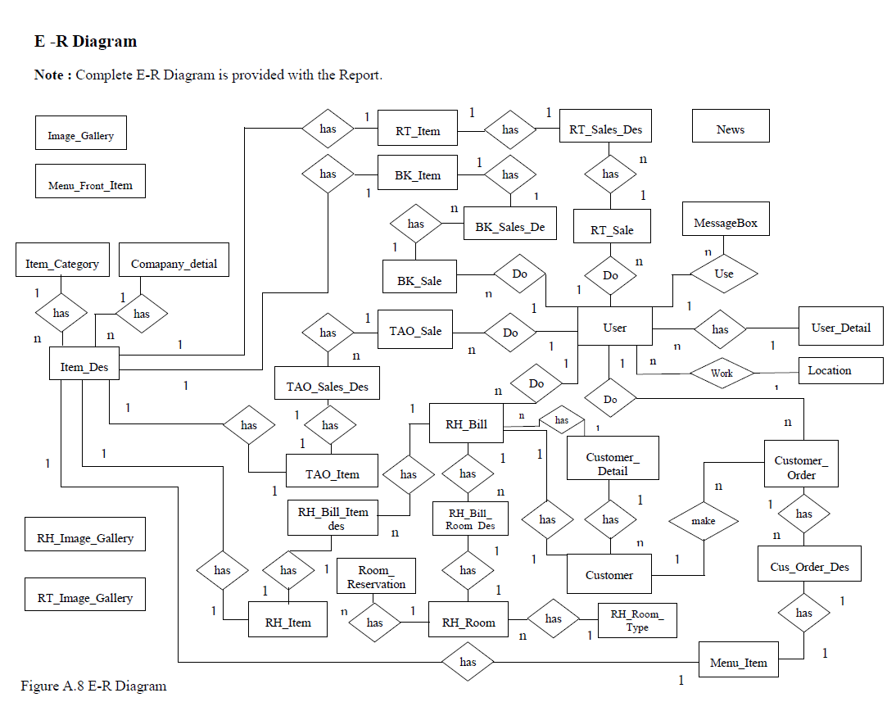
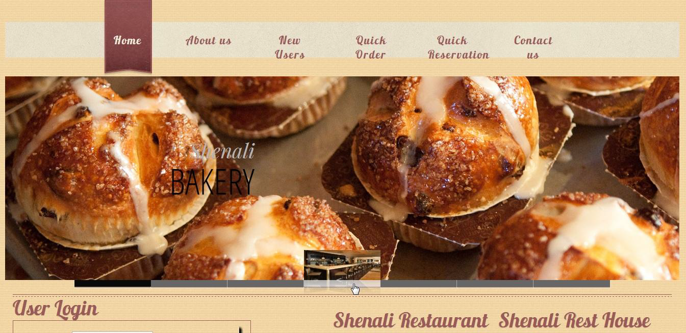
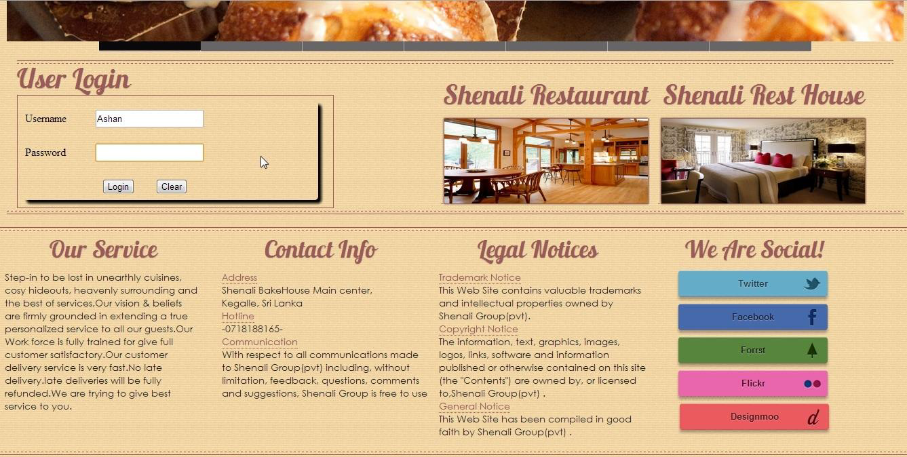
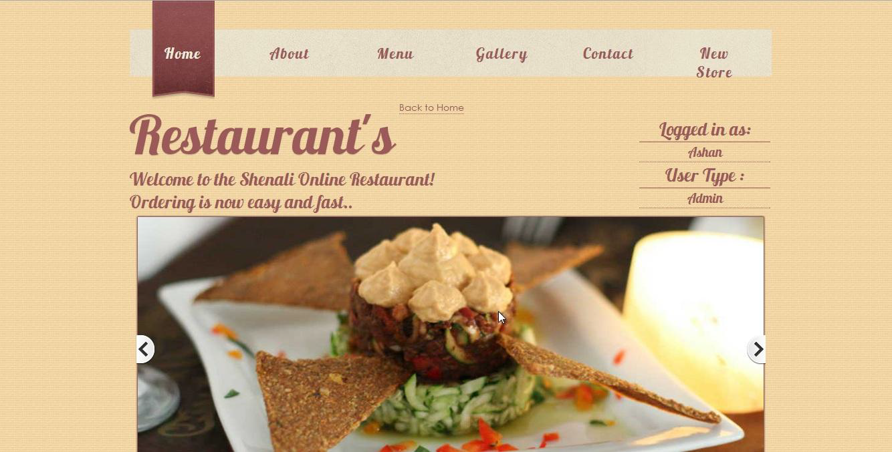
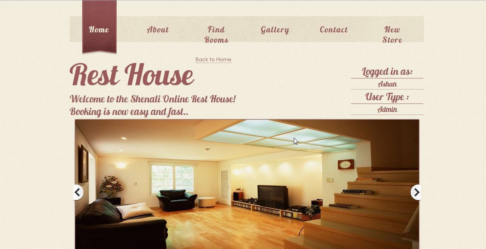
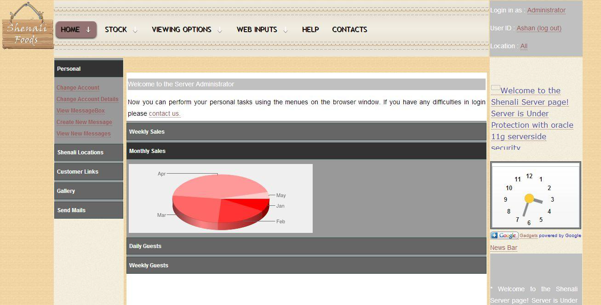

# restaurant-chain-system
# 3rd Year Accademic Project (Working System)

<pre>
Appendix C
User Documentation
Contents
C-1 Log in to the system 
C-2 Location Sale
C-2.1 Bakery Sale 
C-2.2 Restaurant Sale
C-2.3 Take Away Sale 
C-3 Rest House Reservation
C-4 Add New
C-4.1 Add Users 
C-4.2 Add Company Description
C-4.3 Add Item Description
C-4.4 Add Location Item 
C-4.5 Add Rest House Rooms 
C-4.6 Add Rest House Room Type 
C-4.7 Add Menu Front Item
C-4.8 Add Images to Gallery
C-5 Update
C-5.1 Update User Accounts
C-5.2 Update User Details
C-5.3 Update Location Item
C-6 Delete
C-6.1 Delete User Accounts
C-6.2 Delete User Detail
C-6.2 Delete Location Item
C-6.3 Delete Menu Front Item
C-6.4 Delete Images From Gallery
C-7 View
C-7.1 View User Details 
C-7.2 View Online Orders 
C-7.3 View Records
C-8 Message Passing 
</pre>
